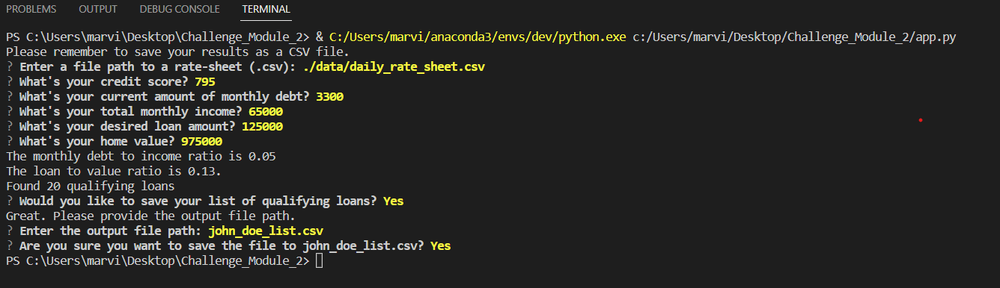
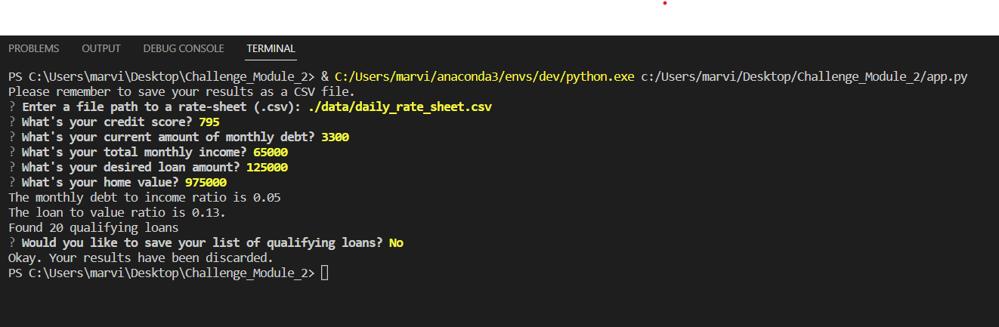

# Loan Qualifier Application

<!-- Just after the title, introduce your project by describing attractively what the project is about and what is the main problem that inspires you to create this project or what is the main contribution for the potential user of your project. -->

This is a python command-line interface application that allows users to see qualifying loans from lenders quickly and easily. The application works by taking in a `daily_rate_sheet` of loan criteria from various loan providers, asking the user a number of questions to evaluate their loan eligibility, and then returning to them a list of qualifying loans.

The qualifying loans can then either be saved or discarded by the user. If the user wishes to save the list of loans, the user will be prompted to enter the output file path and confirm that it is the correct file.

---

## Technologies

<!-- Describe the technologies required to use your project such as programming languages, libraries, frameworks, and operating systems. Be sure to include the specific versions of any critical dependencies that you have used in the stable version of your project. -->

This project leverages python 3.9 with the following packages:

* [fire](https://github.com/google/python-fire) - For the command line interface, help page, and entrypoint.

* [questionary](https://github.com/tmbo/questionary) - For interactive user prompts and dialogs

---

## Installation Guide

<!-- In this section, you should include detailed installation notes containing code blocks and screenshots. -->

Before running the application first install the following dependencies.

```python
  pip install fire
  pip install questionary
```

---

## Usage

<!-- This section should include screenshots, code blocks, or animations explaining how to use your project. -->

To use the loan qualifier application simply clone the repository and run the **app.py** with:

```python
python app.py
```
Upon launching the loan qualifier application you will be greeted with the following prompts.

Both images show the list of questions asked and the potential answers a user may provide.






---

## Contributors

<!-- In this section, list all the people who contribute to this project. You might want recruiters or potential collaborators to reach you, so include your contact email and, optionally, your LinkedIn or Twitter profile. -->

Brought to you by Marvin Lee.
Email: Marvinlee100@gmail.com
---

## License

<!-- When you share a project on a repository, especially a public one, it's important to choose the right license to specify what others can and can't with your source code and files. Use this section to include the license you want to use. -->

MIT
